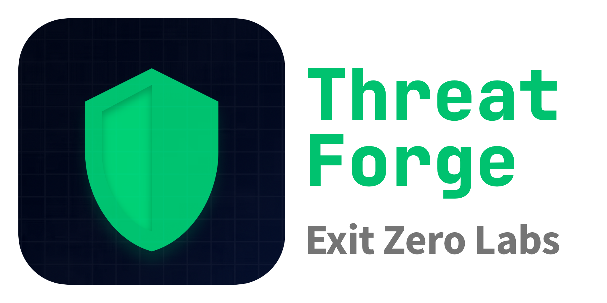
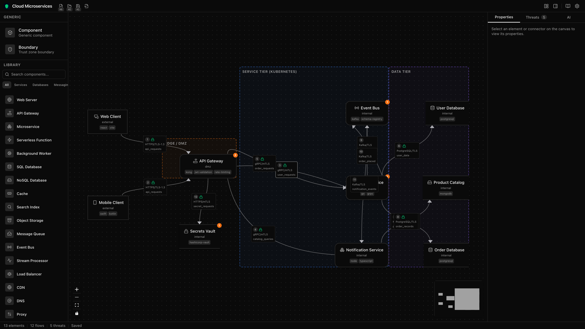

<p align="center">
  
</p>

<p align="center">
  <strong>Open-source threat modeling for teams that ship.</strong>
</p>

<p align="center">
  <a href="#getting-started">Getting Started</a> &nbsp;&bull;&nbsp;
  <a href="#features">Features</a> &nbsp;&bull;&nbsp;
  <a href="#file-format">File Format</a> &nbsp;&bull;&nbsp;
  <a href="#contributing">Contributing</a> &nbsp;&bull;&nbsp;
  <a href="https://threatforge.dev">Website</a>
</p>

<p align="center">
  <a href="LICENSE"></a>
  
  
</p>

<br />

<p align="center">
  
</p>

<br />

ThreatForge is a cross-platform desktop app for threat modeling. It produces human-readable, git-diffable YAML files and uses AI to accelerate threat analysis. Built with [Tauri v2](https://v2.tauri.app/) and React. Runs on macOS, Windows, and Linux.

## The Problem

Threat modeling tools fall into two camps. On one side: Microsoft's Threat Modeling Tool — free, but Windows-only, with a 2016-era UI and opaque `.tm7` binary files that can't be diffed, reviewed, or versioned. On the other: enterprise platforms like IriusRisk and ThreatModeler at $20K+/year.

There's nothing in between for developers who want a modern interface, a clean file format, and AI assistance — without a procurement cycle.

ThreatForge fills that gap.

## Features

### Visual Data Flow Diagrams

Drag-and-drop canvas for building data flow diagrams. 44 typed components across 10 categories (services, databases, messaging, infrastructure, security, clients, networking, cloud/platform, and more), plus resizable trust boundaries and text annotations. Connection handles auto-route between elements.

### STRIDE Threat Engine

Built-in rule engine that applies Microsoft's STRIDE-per-element methodology to your architecture. Generates threats automatically based on element types and data flow patterns. Cross-boundary flows get elevated severity. No AI required — works fully offline.

### AI-Assisted Analysis

Chat with Claude or GPT about your threat model. The AI sees your full architecture — elements, data flows, trust boundaries, and existing threats — and can suggest new threats, propose mitigations, or answer security questions. One-click to accept AI-suggested threats into your model.

Bring your own API key. Supports Anthropic (Claude Opus 4, Sonnet 4, Haiku 3.5) and OpenAI (GPT-4o, GPT-4o Mini). Keys are AES-256-GCM encrypted at rest.

### Import from Microsoft TMT

Import existing `.tm7` files from Microsoft's Threat Modeling Tool. ThreatForge converts elements, data flows, trust boundaries, and threats to the native `.thf` format — preserving positions and STRIDE categories. No more Windows lock-in.

### Pre-built Templates

Start from six production-quality templates: **Cloud Microservices**, **E-Commerce Platform**, **Mobile Banking**, **SaaS Platform**, **IoT Smart Building**, and **Healthcare System**. Each includes a complete data flow diagram with elements, trust boundaries, data flows, and STRIDE threats.

### 15 Themes

8 dark themes (Midnight, Slate, Nord, Dracula, Monokai, GitHub Dark, One Dark, Catppuccin Mocha) and 7 light themes (Daylight, Warm Sand, High Contrast, GitHub Light, Solarized Light, One Light, Catppuccin Latte). Auto-detects system preference.

### Keyboard-First Workflow

- **Command palette** (`Cmd/Ctrl+K`) with fuzzy search across all actions and components
- **27+ keyboard shortcuts** for file operations, canvas navigation, panel switching, and more
- **Undo/redo** with full state history
- **Resizable panels** — palette on the left, properties/threats/AI on the right
- **Canvas minimap**, grid snapping, and arrow-key nudging
- **Copy/paste** elements between models
- **Interactive onboarding** guides for new users
- **Auto-updater** with signature verification

## File Format

The `.thf` format is a single YAML file — human-readable, git-diffable, and portable. No binary blobs, no sidecar files, no vendor lock-in.

```yaml
# ThreatForge Threat Model
version: "1.0"
metadata:
  title: "Payment Processing Service"
  author: "Alex Chen"
  created: 2026-03-15

elements:
  - id: api-gateway
    type: process
    name: "API Gateway"
    trust_zone: dmz
    technologies: [nginx, rate-limiting]
    position: { x: 400, y: 200 }

  - id: payment-db
    type: data_store
    name: "Payment Database"
    trust_zone: internal
    encryption: AES-256-at-rest
    position: { x: 700, y: 200 }

data_flows:
  - id: flow-1
    from: api-gateway
    to: payment-db
    protocol: PostgreSQL/TLS
    data: [transaction_records]

trust_boundaries:
  - id: boundary-1
    name: "Corporate Network"
    contains: [api-gateway, payment-db]

threats:
  - id: threat-1
    title: "SQL Injection on payment queries"
    category: Tampering
    element: api-gateway
    severity: High
    mitigation:
      status: mitigated
      description: "Parameterized queries via ORM"
```

Every element, flow, boundary, and threat is a discrete YAML block. Adding a component or resolving a threat produces a clean, reviewable diff. See the full [file format spec](docs/knowledge/file-format.md).

## Getting Started

### Prerequisites

- [Node.js](https://nodejs.org/) 20+
- [Rust](https://www.rust-lang.org/tools/install) (stable)
- [Tauri v2 prerequisites](https://v2.tauri.app/start/prerequisites/) for your platform

### Install and Run

```bash
git clone https://github.com/exit-zero-labs/threat-forge.git
cd threat-forge
npm install
npm run tauri dev
```

The dev server starts with hot reload on port 1420.

### Build

```bash
npm run tauri build
```

Produces a native desktop binary for your platform (~10MB).

### Test

```bash
npx vitest --run                                       # 417+ frontend tests
cargo test --manifest-path src-tauri/Cargo.toml        # 73+ Rust tests
```

### Lint

```bash
npx biome check .                                      # TypeScript
cargo clippy --manifest-path src-tauri/Cargo.toml      # Rust
```

### Local CI

```bash
npm run ci:local          # Native lint + test (~30s)
npm run ci:docker         # Docker lint + test (clean environment)
npm run ci:docker:build   # Docker lint + test + Tauri build
```

## Tech Stack

| Layer | Technology |
|-------|-----------|
| Desktop framework | [Tauri v2](https://v2.tauri.app/) (Rust backend, native webview) |
| Frontend | React 19, TypeScript 5 (strict), Tailwind CSS 4, shadcn/ui |
| Diagramming | [ReactFlow / xyflow](https://reactflow.dev/) |
| State management | Zustand |
| File format | Custom YAML schema (serde_yaml) |
| Testing | Vitest + React Testing Library, cargo test, Playwright |
| Linting | Biome (TypeScript), Clippy (Rust) |
| CI/CD | GitHub Actions (matrix: macOS, Windows, Linux) |

## Architecture

```
┌──────────────────────────────────────────────────┐
│                 Tauri v2 Shell                    │
├────────────────────┬─────────────────────────────┤
│   React Frontend   │        Rust Backend         │
│                    │                             │
│  ReactFlow Canvas ◄──IPC──► File I/O (YAML)     │
│  Zustand Stores   ◄──IPC──► STRIDE Engine       │
│  AI Chat Pane     ◄──IPC──► AI Providers (SSE)  │
│  Settings / UI    ◄──IPC──► Key Storage (AES)   │
└────────────────────┴─────────────────────────────┘
         │                        │
         ▼                        ▼
    Local .thf files       LLM APIs (optional)
                        (Anthropic / OpenAI)
```

All AI calls go directly from the user's machine with the user's API key. No proxy, no telemetry on model content. See the full [architecture doc](docs/knowledge/architecture.md).

## Security

ThreatForge is a security tool — the bar for security in our own code is high.

- **API keys** encrypted at rest with AES-256-GCM
- **AI calls** go directly to the provider — no intermediary server
- **LLM output** treated as untrusted input and sanitized before rendering
- **File paths** scoped via Tauri's capability system
- **Strict CSP** — no inline scripts, no remote code loading
- **Auto-updates** are signature-verified
- **Minimal dependencies** — audited with `cargo audit` and `npm audit`

To report a vulnerability, see [SECURITY.md](SECURITY.md). Do not open a public issue.

## Contributing

Contributions welcome. See [CONTRIBUTING.md](CONTRIBUTING.md) for setup instructions, code style, and PR guidelines.

Areas where help is especially valuable:
- STRIDE threat rule expansion
- Import/export (OWASP Threat Dragon `.json`, PDF export)
- Accessibility (WCAG compliance)
- Documentation and example threat models

## Support the Project

ThreatForge is free and open source. If it's useful to you:

- [**Sponsor on GitHub**](https://github.com/sponsors/exit-zero-labs) — recurring or one-time
- **Star the repo** — helps others find the project
- **Contribute** — code, docs, threat rules ([CONTRIBUTING.md](CONTRIBUTING.md))
- **Share** — tell your team or post about it

## License

Copyright 2026 Exit Zero Labs LLC. Licensed under the [Apache License 2.0](LICENSE).

---

<p align="center">
  Built by <a href="https://exitzerolabs.com">Exit Zero Labs</a>. Ship clean. Build forward.
</p>
