# ThreatForge — Implementation Plan

## 1. Executive Summary

**ThreatForge** is an open-source, AI-enhanced, cross-platform desktop threat modeling application built with Tauri v2 + React + TypeScript. It targets the underserved gap between Microsoft’s legacy TMT and enterprise platforms (ThreatModeler/IriusRisk at $20K+/year), producing human-readable, git-diffable YAML/Markdown files with integrated AI assistance.

**Executor context:** Solo developer (Shreyas), side project, evening/weekend cadence. Background in React/TypeScript, Microsoft Teams AI feature development, security engineering culture. M1 Pro MacBook as primary dev machine. Budget: ~$750/year. No external capital required.

**Timeline overview:**
- **Phase 0 — Validation (Week 1):** File format prototype + ReactFlow DFD spike
- **Phase 1 — MVP (Weeks 2-8):** Core canvas + YAML format + STRIDE engine (no AI)
- **Phase 2 — AI + Launch (Weeks 9-14):** AI chat pane, cross-platform builds, public launch
- **Phase 3 — Community (Weeks 15-22):** Import/export, reports, community feedback loop
- **Phase 4 — Ecosystem (Months 6-12):** TM-BOM standard, OWASP application, i18n

**Total estimated cost:** ~$750/year (code signing + domain + design assets). Developer time: 10-15 hrs/week.

**Top 3 risks and mitigations:**
1. **ReactFlow insufficient for DFDs** → Time-boxed 3-day prototype spike in Week 1; fallback to form-based element entry with auto-generated diagrams
2. **Low adoption / no community forms** → Multi-channel launch (HN + Reddit + security newsletters); file-format virality as organic growth loop; kill gate at <100 stars in 2 weeks post-launch
3. **Solo dev burnout** → Ruthless scope discipline via MoSCoW; 8-week MVP deadline enforced via circuit breaker; burnout kill gate (3+ consecutive weeks of dreading the project)

**Key assumptions:** Tauri v2 is stable enough for production desktop apps [High confidence]. ReactFlow can be customized for DFD conventions [Medium confidence — requires validation spike]. Developers will adopt a new file format if it’s genuinely better [Medium confidence — requires demand validation at launch].

**Confidence: Medium.** Timeline is aggressive for a solo side project. Phase 0 validation gates de-risk the two biggest technical unknowns. The extremely low capital requirement ($750/year) means downside is limited to time invested.

---

## 2. Strategic Context & Objectives

### 2.1 Project Definition

- **What is being built?** A cross-platform desktop application (Tauri v2 + React) for creating, editing, and maintaining threat models. Key differentiators: human-readable YAML file format, modern diagramming canvas, AI-assisted threat generation.
- **Who is it for?** Individual developers and small security teams (2-10 people) at companies with 50-500 employees who currently use Microsoft TMT reluctantly or skip threat modeling entirely.
- **Core value prop:** 10x improvement in the threat modeling experience through the combination of AI-assisted generation, human-readable git-diffable files, and a modern UI.
- **Stage:** Greenfield open-source project. Pre-revenue, donation-funded.

### 2.2 Objectives & Key Results (OKRs)

| Objective | Key Result 1 | Key Result 2 | Key Result 3 | Timeframe |
| --- | --- | --- | --- | --- |
| Ship a usable MVP | Working DFD canvas with STRIDE analysis | YAML file format validated as git-diffable | App runs on Mac + Windows + Linux | 8 weeks |
| Achieve community traction | 2,000+ GitHub stars | 2,000 MAU (opt-in telemetry) | 1,000 downloads/month | 6 months |
| Establish ecosystem presence | First external contributor PR merged | Apply for OWASP project status | First corporate sponsor | 12 months |

### 2.3 Scope Definition

| In Scope (v1) | Out of Scope (v1) | Future Consideration |
| --- | --- | --- |
| DFD diagramming canvas (ReactFlow) | Real-time multi-user collaboration | When 10K+ users, consider Excalidraw+ model |
| YAML/MD human-readable file format | Cloud/SaaS hosting | When file format gains traction |
| STRIDE threat enumeration engine | Compliance framework mapping (PCI DSS, NIST) | Phase 4 if enterprise demand |
| AI chat side pane (BYOK) | Fine-tuned ML models | When BYOK quality validated |
| Cross-platform via Tauri (Win/Mac/Linux) | Mobile apps | Not planned |
| Custom SVG icon support | Plugin/extension system | Phase 4+ |
| Dark mode + keyboard shortcuts | Collaborative git merge tooling | Phase 4 if community requests |

### 2.4 Success Criteria & Kill Gates

| Phase | Success Criteria | Kill Gate | Decision Date |
| --- | --- | --- | --- |
| **Phase 0 (Week 1)** | YAML diffs are clean on 10 sample models; ReactFlow DFD prototype feels responsive | Either validation fails | End of Week 1 |
| **Phase 1 (Week 8)** | Can draw DFD, auto-generate STRIDE threats, save/reopen human-readable YAML | Canvas doesn’t feel fast; self-assessment “Would I use this?” = No | End of Week 8 |
| **Phase 2 (Week 14)** | Public launch on GitHub; first 100 stars | <100 stars in first 2 weeks after launch | Week 16 |
| **Phase 3 (Week 22)** | 1,000+ stars, 500+ downloads, first external contributor | 0 external contributors after 6 months | Month 9 |
| **Burnout gate** | Enjoying working on it | Dreading it for 3+ consecutive weeks | Ongoing |

### 2.5 Constraints & Dependencies

**Hard Constraints:**

| Constraint | Detail | Planning Impact |
| --- | --- | --- |
| Budget | ~$750/year personal funds | No paid services beyond code signing + domain |
| Time | Side project; 10-15 hrs/week (evenings + weekends) | Sprint velocity ~50% of full-time; 8-week MVP = ~4 FTE-weeks |
| Team | Solo developer, no hires planned | Architecture must be simple enough for one person to maintain |
| Technical | Tauri v2 + React (committed) | WebView rendering differences across platforms |

**External Dependencies:**

| Dependency | Type | Risk Level | Lead Time | Mitigation |
| --- | --- | --- | --- | --- |
| ReactFlow/xyflow | Core library | Medium | 0 (MIT licensed) | Prototype spike validates fit; fallback to form-based entry |
| Apple Developer Program | Code signing | Low | 1-2 weeks | Apply in Phase 1 |
| Windows Authenticode cert | Code signing | Low | 1-2 weeks | SignPath.io free for OSS, or SSL.com |
| LLM APIs (OpenAI/Anthropic) | AI features | Low | 0 (BYOK model) | AI features are optional; core works offline |
| GitHub Actions | CI/CD | Low | 0 (free for public repos) | Well-documented, stable |

**Confidence: High** — Constraints are well-understood and the project is designed to operate within them.

---

## 3. Technical Architecture & Infrastructure Plan

### 3.1 Architecture Decision Records (ADRs)

| ADR # | Decision | Options Considered | Chosen | Rationale | Key Tradeoff | Revisit Trigger |
| --- | --- | --- | --- | --- | --- | --- |
| ADR-001 | Desktop framework | Electron, Flutter Desktop, Tauri v2 | Tauri v2 | ~10MB binary vs 100MB+ Electron; Rust backend for security/perf; native OS webview | Smaller ecosystem than Electron; Rust learning curve for contributors | If Tauri has critical bugs blocking cross-platform |
| ADR-002 | Diagramming library | mxGraph (draw.io), JointJS, AntV/X6, ReactFlow | ReactFlow (xyflow) | MIT license; React-native; excellent performance; active development; built for node-based UIs | Less “traditional” DFD tooling than draw.io | If DFD conventions require more custom work than expected (Phase 0 spike) |
| ADR-003 | File format | JSON, TOML, XML, SQLite, YAML | Custom YAML schema | Human-readable; git-diffable; YAML anchors for reuse; familiar to developers | YAML indentation gotchas; mitigated by strict schema validation | If git diffs prove noisy in practice (Phase 0 validation) |
| ADR-004 | State management | Redux, Jotai, React Context, Zustand | Zustand | Minimal boilerplate; great TypeScript support; performant; recommended for Tauri apps | Less middleware ecosystem than Redux | Not likely; Zustand is well-suited |
| ADR-005 | AI integration model | Built-in API key, fine-tuned model, BYOK | BYOK (user-provided key) | Zero cost to project; no rate limiting; user controls data; supports any provider | Requires user to have an API key | When local model support (Ollama) is good enough for default |
| ADR-006 | Layout data storage | In YAML alongside model, separate JSON file | Separate `.threatforge/layouts/*.json` | Keeps YAML diffs clean (repositioning elements doesn’t pollute threat model diff) | Two file types per model | When/if a stable auto-layout algorithm eliminates need for stored positions |
| ADR-007 | API key storage | Plaintext config, encrypted file, OS keychain | OS keychain via Tauri plugin | macOS Keychain, Windows Credential Manager, Linux Secret Service — OS-level security | Platform-specific implementation complexity (handled by Tauri plugin) | N/A — this is the correct approach |
| ADR-008 | UI library | MUI, Chakra, Ant Design, Tailwind+shadcn | Tailwind CSS + shadcn/ui | Lightweight, customizable, excellent dark mode, growing Tauri adoption | More manual composition | N/A — strong choice for this use case |

### 3.2 System Architecture

### 3.3 Technology Stack

| Layer | Chosen | Why | Revisit Trigger |
| --- | --- | --- | --- |
| App Framework | Tauri v2 (Rust) | 10MB binary, native webview, security sandbox | N/A |
| Frontend | React 19 + TypeScript 5.x | Largest contributor pool; Shreyas’s expertise | N/A |
| Styling | Tailwind CSS 4 + shadcn/ui | Lightweight, dark mode, customizable | N/A |
| Canvas | ReactFlow (xyflow) | MIT, React-native, performant, active dev | Phase 0 spike result |
| State | Zustand | Minimal boilerplate, TypeScript-first | N/A |
| File Format | Custom YAML schema (serde_yaml) | Human-readable, git-diffable | Phase 0 validation result |
| Testing (Frontend) | Vitest + React Testing Library | Fast, Vite-compatible | N/A |
| Testing (Rust) | cargo test | Standard Rust testing | N/A |
| E2E Testing | Playwright (Tauri WebDriver) | Cross-platform, reliable | N/A |
| CI/CD | GitHub Actions | Free for public repos, excellent Tauri support | N/A |
| Auto-update | Tauri updater plugin + GitHub Releases | Built into Tauri, free hosting | N/A |
| Linting | ESLint + Clippy (Rust) | Standard for each ecosystem | N/A |
| Formatting | Prettier (TS) + rustfmt | Standard | N/A |

### 3.4 Data Architecture — File Format

The file format IS the product’s moat. Core design principles:
1. Human-readable when opened in any text editor
2. Minimal, clean diffs when tracked in git
3. Schema-validated for tooling interoperability
4. Convertible to/from TM-BOM (CycloneDX) standard

**Structure:**
- `.threatforge.yaml` — Main threat model (elements, flows, trust boundaries, threats, metadata)
- `.threatforge/layouts/*.json` — Canvas layout data (positions, zoom, viewport) stored separately to keep YAML diffs clean
- Custom SVG icons stored alongside model in repo

### 3.5 Infrastructure & DevOps

**Environment Strategy:**

| Environment | Purpose | Infrastructure | Cost |
| --- | --- | --- | --- |
| Local | Developer workstation | `cargo tauri dev` (hot reload) | $0 |
| CI | Automated builds + tests | GitHub Actions matrix (ubuntu, macos, windows) | $0 (public repo) |
| Release | Signed binaries | GitHub Releases | $0 |
| Website | Docs + landing page | GitHub Pages or Cloudflare Pages | $0 |

### 3.6 Monitoring & Observability

| Layer | Tool | What to Track |
| --- | --- | --- |
| Error tracking | Sentry (free tier for OSS) | Crash reports, unhandled exceptions, JS errors |
| Analytics | PostHog (free tier) or custom opt-in telemetry | Feature usage, session duration, platform distribution |
| Uptime | UptimeRobot (free) | Website + update server availability |
| Community health | GitHub Insights + custom dashboard | Stars, forks, issues, PRs, contributor count |

### 3.7 Security Architecture

| Security Layer | Approach | Implementation |
| --- | --- | --- |
| API Key Storage | OS native keychain | Tauri keychain plugin |
| AI API Calls | Direct from user’s machine | HTTPS only; keys never touch project files |
| File Integrity | Schema validation on read | serde strict deserialization; reject unknown fields |
| Auto-Update | Signed releases | Tauri updater with signature verification |
| Supply Chain | Dependency auditing | Dependabot + cargo-audit in CI |
| CSP | Strict Content Security Policy | Tauri default CSP; no remote code loading |
| Input Sanitization | All user input validated | Rust-side for file ops; React-side for UI |

**Confidence: High** — The technology stack is proven and well-documented. Tauri v2 is stable (released October 2024), ReactFlow is actively maintained (MIT license), and the architecture is deliberately simple for a solo maintainer.

---

## 4. Implementation Roadmap & Sprint Plans

### 4.1 Phase Overview

Framework: **Shape Up** (appetite-based, not estimate-based). As a solo bootstrapped developer, Shape Up’s circuit breaker philosophy is the right fit — if a feature can’t be built within its time budget, stop and reshape, don’t extend.

**Velocity assumption:** 10-15 hrs/week → ~12 productive hours/week → ~60 productive hours per 5-week phase, accounting for 35% overhead (debugging, learning, code review, context switching).

### 4.2 Phase 0: Validation (Week 1) — Appetite: 1 week

**This is the go/no-go gate.** Do NOT proceed to Phase 1 without passing both validations.

| Day | Task | Est. Hours | Deliverable | Success Criteria |
| --- | --- | --- | --- | --- |
| Day 1 | Design YAML schema v0.1 | 3h | Schema spec + 5 sample files | Schema is clean, readable |
| Day 2 | Create 10 sample threat models, commit to test repo, make typical edits | 3h | Git repo with realistic diffs | Diffs are clean, reviewable, minimal noise |
| Day 3-5 | ReactFlow DFD prototype: processes, data stores, external entities, data flows, trust boundaries | 8h | Working prototype in browser | Can draw a basic DFD that “feels right”; trust boundaries render as groups |

**Kill gates:**
- YAML diffs are noisy or unreadable → Consider TOML or structured JSON with custom diff tooling, or shelve project
- ReactFlow trust boundaries require >3 days of custom work → Fallback to YAML-defined boundaries rendered as colored backgrounds, not interactive shapes

### 4.3 Phase 1: MVP (Weeks 2-8) — Appetite: 7 weeks

**Goal:** Core diagramming canvas + YAML file format + STRIDE engine. No AI yet. A user can draw a DFD, auto-generate STRIDE threats, save to a human-readable YAML file, and reopen it.

**Sprint 1 (Weeks 2-3): Foundation + Scaffold**

| Task | Est. Days | Dependencies | Deliverable |
| --- | --- | --- | --- |
| Tauri v2 + React 19 + TypeScript scaffold | 1 | Phase 0 complete | App launches with hot reload |
| Tailwind + shadcn/ui setup + dark mode | 0.5 | Scaffold | Themed component library |
| Zustand store architecture (threat model state) | 1 | Scaffold | TypeScript types for model + store |
| Rust backend: serde YAML schema types | 1 | Phase 0 schema | Rust types matching YAML spec |
| Rust backend: file read/write commands | 1.5 | serde types | Can save/load .threatforge.yaml via Tauri IPC |
| Rust backend: schema validation on read | 1 | file read/write | Invalid files rejected with clear errors |

**Sprint 1 exit:** App scaffolded, can read/write YAML files, Zustand store wired to Rust backend.

**Sprint 2 (Weeks 4-5): Diagramming Canvas**

| Task | Est. Days | Dependencies | Deliverable |
| --- | --- | --- | --- |
| ReactFlow canvas integration with custom DFD node types | 3 | Sprint 1 | Draggable process, data store, external entity nodes |
| Data flow edges with labels (protocol, data) | 2 | Custom nodes | Directional edges with metadata |
| Trust boundary groups (ReactFlow groups or custom rendering) | 3 | Custom nodes | Visual boundary grouping |
| Component palette (left sidebar) with drag-to-canvas | 1 | Canvas | Palette of DFD elements |
| Canvas ↔︎ Zustand ↔︎ YAML sync (save canvas state to file) | 2 | All canvas work | Canvas state persists to .threatforge.yaml + layout JSON |
| Layout file separation (.threatforge/layouts/) | 1 | Canvas sync | Layout coords in separate file |

**Sprint 2 exit:** Can draw a full DFD with all element types, trust boundaries, and data flows. Canvas state saves and reloads.

**Sprint 3 (Weeks 6-7): STRIDE Engine + Threat Management**

| Task | Est. Days | Dependencies | Deliverable |
| --- | --- | --- | --- |
| Rust STRIDE rule engine (per-element threat suggestions) | 3 | Sprint 2 | Given element type + context, suggest relevant STRIDE threats |
| Threat analysis panel (right sidebar) | 2 | STRIDE engine | Table/list of threats, filterable by category/severity |
| Threat-to-element linking (click threat → highlight element) | 1 | Panel + canvas | Bidirectional navigation |
| Threat editing (accept/modify/dismiss AI-suggested threats) | 1.5 | Threat panel | CRUD for threats with status tracking |
| Mitigation tracking (status, description per threat) | 1 | Threat editing | Mitigations persist to YAML |
| Element properties panel (right sidebar, context-sensitive) | 1.5 | Canvas nodes | Click element → see/edit properties |

**Sprint 3 exit:** STRIDE threats auto-generated for diagram elements. Full threat management workflow.

**Sprint 4 (Week 8): Integration + Polish**

| Task | Est. Days | Dependencies | Deliverable |
| --- | --- | --- | --- |
| End-to-end flow testing (new model → draw → analyze → save → reopen) | 1.5 | All prior | Happy path works reliably |
| Custom SVG icon support on elements | 1 | Canvas nodes | Users can assign custom icons |
| Keyboard shortcuts (delete, undo/redo, zoom, pan) | 1 | Canvas | Fluid keyboard navigation |
| Welcome screen / first-run experience | 0.5 | All | New users oriented quickly |
| Cross-platform smoke testing (Mac, Windows, Linux) | 1 | All | App runs on all platforms |
| Bug fixes + UX polish | 2 | All | MVP quality bar met |

**Sprint 4 exit / Phase 1 kill gate:** “Would I use this?” = Yes. The DFD drawing experience feels fast and responsive.

### 4.4 Phase 2: AI + Launch (Weeks 9-14) — Appetite: 6 weeks

**Sprint 5 (Weeks 9-10): AI Chat Pane**

| Task | Est. Days | Dependencies | Deliverable |
| --- | --- | --- | --- |
| BYOK API key configuration UI + OS keychain storage | 1 | Phase 1 | Settings page for API keys |
| AI chat pane component (collapsible right panel) | 2 | Keychain | Chat UI with message history |
| Prompt construction: serialize current model state as context | 2 | Chat pane + Zustand | AI can “see” the current threat model |
| LLM integration: OpenAI + Anthropic API support | 1.5 | Chat pane | Multi-provider BYOK |
| Ollama (local model) support | 1 | LLM integration | Works fully offline with local models |
| AI response parsing: extract suggested threats, accept with one click | 2 | LLM integration | Actionable AI suggestions |
| Prompt injection protection: input sanitization, output validation | 0.5 | AI integration | Basic guardrails |

**Sprint 5 exit:** AI chat pane working with BYOK. Can ask AI about threats, get suggestions, accept them into the model.

**Sprint 6 (Weeks 11-12): Cross-Platform + CI**

| Task | Est. Days | Dependencies | Deliverable |
| --- | --- | --- | --- |
| GitHub Actions CI matrix (ubuntu, macos-latest, windows-latest) | 1.5 | All | Lint + test + build on all platforms |
| Code signing setup: Apple Developer + Windows Authenticode | 2 | CI | Signed binaries for Mac + Windows |
| Tauri auto-updater configuration + GitHub Releases | 1 | Signed builds | Auto-update flow working |
| Cross-platform testing + bug fixes | 3 | Signed builds | App works cleanly on all 3 OS |
| Linux packaging (AppImage + .deb) | 1 | CI | Linux distribution ready |

**Sprint 6 exit:** Signed, auto-updating binaries for all three platforms via GitHub Releases.

**Sprint 7 (Weeks 13-14): Launch Prep**

| Task | Est. Days | Dependencies | Deliverable |
| --- | --- | --- | --- |
| Landing page / project website (GitHub Pages) | 1.5 | All | threatforge.dev or similar |
| README.md with screenshots, demo GIF, installation instructions | 1 | All | Compelling GitHub landing |
| CONTRIBUTING.md + code of conduct + license (Apache 2.0) | 0.5 | All | Community-ready repo |
| Opt-in telemetry (PostHog free tier or custom) | 1 | All | Anonymous usage analytics |
| Demo video / walkthrough (2-3 min) | 1 | All | Published, embedded on landing page |
| Write HN “Show HN” post + Reddit posts | 0.5 | All | Launch drafts ready |
| Build-in-public thread on Twitter/X | 0.5 | All | Pre-launch awareness |
| Launch: HN + Reddit r/netsec + r/cybersecurity + security newsletters | 1 | All content | **PUBLIC LAUNCH** |

**Phase 2 kill gate:** <100 GitHub stars in first 2 weeks after launch → Reassess scope and positioning before investing Phase 3 effort.

### 4.5 Phase 3: Community (Weeks 15-22) — Appetite: 8 weeks

| Workstream | Scope | Priority | Success Criteria |
| --- | --- | --- | --- |
| Microsoft TMT (.tm7) import | Parse binary format, convert to .threatforge.yaml | P0 | Can import existing MS TMT files |
| OWASP Threat Dragon (.json) import | Parse JSON, convert to .threatforge.yaml | P1 | Can import Threat Dragon files |
| PDF/HTML export | Generate threat model reports for stakeholders | P1 | Professional-looking export |
| Community feedback iteration | Bug fixes, UX improvements from GitHub Issues | P0 | Responsive to community |
| LINDDUN privacy methodology support | Additional threat taxonomy alongside STRIDE | P2 | Toggle between STRIDE/LINDDUN |
| Multiple diagrams per model | Complex systems need multiple views | P2 | Multi-diagram support |

### 4.6 Phase 4: Ecosystem (Months 6-12)

| Workstream | Trigger | Scope |
| --- | --- | --- |
| TM-BOM (CycloneDX) export | Community requests + OWASP standard maturity | Standard interchange format |
| CI/CD GitHub Action | 1,000+ users requesting pipeline integration | Validate threat model freshness in CI |
| OWASP project application | 3,000+ stars, active community | Official OWASP recognition |
| i18n framework + translations | Community volunteers available | String externalization + community-driven translations |
| GitHub Sponsors + Open Collective | 5,000+ users | Sustainability funding |

### 4.7 Critical Path & Dependencies

```mermaid
graph TD
    V["Phase 0: YAML + ReactFlow Validation"] --> A1["Tauri Scaffold"]
    V --> A2["YAML Schema + serde types"]
    A1 --> A3["ReactFlow Canvas<br/>(CRITICAL PATH)"]
    A2 --> A4["File Read/Write"]
    A4 --> A3
    A3 --> A5["STRIDE Engine"]
    A5 --> A6["Integration + Polish"]
    A6 --> B1["AI Chat Pane"]
    A6 --> B2["Cross-Platform CI/Signing"]
    B1 --> B3["Launch Prep"]
    B2 --> B3
    B3 --> LAUNCH["🚀 PUBLIC LAUNCH"]
    LAUNCH --> C1["Import/Export"]
    LAUNCH --> C2["Community Feedback"]

    style A3 fill:#ff9999
    style V fill:#ffcc99
    style LAUNCH fill:#99ff99
```

**Critical path:** Phase 0 validation → Tauri scaffold → ReactFlow canvas → STRIDE engine → Integration → AI pane + CI builds → Launch. The canvas is the longest and highest-risk item on the critical path.

### 4.8 Development Workflow & Standards

- **Branching:** Trunk-based development. `main` is always deployable. Feature branches are short-lived (max 3 days).
- **Commits:** Conventional Commits (`feat:`, `fix:`, `chore:`, etc.)
- **Linting:** ESLint (strict) + Clippy (Rust), enforced in CI
- **Formatting:** Prettier (TS) + rustfmt (Rust), enforced in CI
- **Testing:** Vitest (frontend) + cargo test (Rust). E2E via Playwright for critical paths.
- **Definition of Done:** Code passes CI, works on all platforms (tested via CI matrix), critical paths have tests.

**Confidence: Medium.** Timeline estimates are based on solo-developer velocity assumptions that haven’t been validated against this specific stack. First sprint will calibrate. The Shape Up circuit breaker approach means features that exceed their appetite get stopped, not extended.

---

## 5. Resource & Team Plan

### 5.1 Team Evolution Model

| Phase | Team | Monthly Cost | Notes |
| --- | --- | --- | --- |
| Phase 0-2 (Months 1-4) | Shreyas (solo) | $0 (side project time) + ~$60/mo tools | All development, design, marketing |
| Phase 3 (Months 4-6) | Shreyas + community contributors | $0 + bounties possible | First external PRs |
| Phase 4 (Months 6-12) | Shreyas + 2-5 community contributors | $0-500/mo (bounties from sponsors) | Growing contributor base |

**[Team-dependent]** If ThreatForge gains significant traction (>10K users), the bottleneck shifts from engineering to community management. At that point, consider applying for OWASP project status for organizational support.

### 5.2 Build vs. Buy Matrix

| Capability | Build | Buy/Use | Recommended | Rationale |
| --- | --- | --- | --- | --- |
| Diagramming | Custom DFD engine | ReactFlow (MIT, free) | Buy (ReactFlow) | Proven library; custom engine is months of work |
| File format | Custom YAML schema | N/A | Build | Core differentiator; must be custom |
| STRIDE engine | Custom rule engine | N/A | Build | Domain-specific; no good library exists |
| AI integration | Custom LLM wrapper | LangChain / Vercel AI SDK | Build (thin wrapper) | BYOK is simple; no framework needed |
| UI components | Custom | shadcn/ui (free) | Buy (shadcn) | High quality, customizable, MIT |
| CI/CD | Custom | GitHub Actions (free for OSS) | Buy | Best-in-class, free |
| Error tracking | Custom | Sentry (free tier for OSS) | Buy | Industry standard, free for OSS |
| Analytics | Custom telemetry | PostHog (free tier) | Buy initially | Build custom when justified |

**Confidence: High** — Solo developer plan with minimal costs. The risk is entirely time, not money.

---

## 6. Go-to-Market Execution Plan

### 6.1 Pre-Launch Playbook (Weeks 11-14, during Phase 2)

| Week | Action | Channel | Deliverable |
| --- | --- | --- | --- |
| W-4 | Start “build in public” thread on Twitter/X | Social | Weekly progress updates with screenshots/GIFs |
| W-3 | Join and engage in r/netsec, r/cybersecurity, OWASP Slack | Community | Genuine participation (NOT pitching) |
| W-3 | Write blog post: “Why Threat Models Should Be Git-Diffable” | Content | Published on personal blog / dev.to |
| W-2 | Create demo video (2-3 min) | Content | Published on YouTube |
| W-2 | Set up project website with download links | Web | Live landing page |
| W-1 | Draft HN “Show HN” post, Reddit posts, newsletter pitches | Content | Ready to submit |
| W-1 | Email security newsletter editors (tl;dr sec, Risky Business, etc.) | Outreach | Personalized pitches |

### 6.2 Launch Week

| Day | Action | Goal |
| --- | --- | --- |
| Monday | Publish on GitHub, write first blog post | Repo live |
| Tuesday | Submit “Show HN: ThreatForge — OSS threat modeling with git-friendly YAML” | Front page (target: 100+ points) |
| Wednesday | Post to r/netsec, r/cybersecurity, r/devsecops | Community awareness |
| Thursday | Share on Twitter/X, LinkedIn (security communities) | Developer awareness |
| Friday | Email security newsletters | Media coverage |
| Weekend | Respond to EVERY comment, issue, star, DM | 100% response rate |

### 6.3 Growth Loops

**Primary loop:** File-format virality. When one team member commits a `.threatforge.yaml`, others need ThreatForge to view/edit it. This is the same mechanism that spread Terraform’s `.tf` files, Prettier’s config, and ESLint configs through teams.

**Secondary loop:** Build-in-public content → developer community → organic discovery.

### 6.4 Content Strategy (Post-Launch, Ongoing)

| Content Type | Frequency | Purpose | Distribution |
| --- | --- | --- | --- |
| “Build in public” updates | Weekly | Community engagement | Twitter/X, LinkedIn |
| Threat modeling tutorials | 2/month | SEO, thought leadership | Blog, dev.to, Medium |
| “Threat Modeling [X] with ThreatForge” walkthroughs | 1/month | Practical value, SEO | Blog + YouTube |
| Release notes | Per release | User engagement | GitHub + blog |
| Comparison: “ThreatForge vs Microsoft TMT” | Once | Capture high-intent search | Blog (SEO-optimized) |

**Confidence: Medium** — The file-format virality loop is proven in developer tools but requires critical mass. HN launch is a one-shot opportunity that must be well-executed.

---

## 7. Budget & Financial Plan

### 7.1 Cost Structure

| Category | Year 1 | Year 2 | Notes |
| --- | --- | --- | --- |
| Apple Developer Program | $99 | $99 | macOS code signing |
| Windows Authenticode cert | ~$300 | ~$300 | SignPath.io free for OSS, or SSL.com |
| Domain (threatforge.dev) | $12-50 | $12-50 | Cloudflare registrar |
| Design assets | $150 | $150 | Icons, screenshots |
| CI/CD compute | $0 | $0 | GitHub Actions free for public repos |
| Hosting (website/docs) | $0 | $0 | GitHub Pages / Cloudflare Pages |
| Error tracking (Sentry) | $0 | $0 | Free for OSS |
| Analytics (PostHog) | $0 | $0 | Free tier |
| **Total** | **~$560-600** | **~$560-600** |  |

### 7.2 Funding Model

| Source | Mechanism | Estimated Annual (Year 2+) | Probability |
| --- | --- | --- | --- |
| GitHub Sponsors | Individual $5-25/mo | $5,000-$30,000 | Medium |
| Corporate sponsors | Logo placement, support | $10,000-$50,000 | Medium (requires 10K+ users) |
| Open Collective | One-time + recurring | $2,000-$10,000 | Medium |

**Break-even:** Project is already “break-even” at $600/year personal investment. Any sponsorship revenue is upside for bounties and contributor rewards.

### 7.3 Sustainability Milestones

| Milestone | Metric | Significance | Timeline |
| --- | --- | --- | --- |
| Self-sustaining infrastructure | Sponsors cover $600/year costs | Infrastructure costs covered | Month 6-12 |
| Bounty-funded development | $500+/month in sponsorships | Can fund community bounties | Month 12-18 |
| OWASP project status | Official acceptance | Organizational backing, brand credibility | Month 12-18 |

**Confidence: Low-Medium** — Open-source funding is inherently unpredictable. The project must be viable as a passion project first. The ~$600/year cost means this is sustainable indefinitely from personal budget.

---

## 8. Quality Assurance Strategy

### 8.1 Testing Pyramid

| Test Type | Scope | Coverage Target | Tools | When Run |
| --- | --- | --- | --- | --- |
| Unit tests | Rust functions, React components | >60% (STRIDE engine: >80%) | cargo test, Vitest | Every push |
| Integration tests | Tauri IPC, file I/O round-trip | All critical paths | cargo test + Vitest | Every push |
| E2E tests | Full user journeys (create → draw → save → reopen) | Top 5 workflows | Playwright + Tauri WebDriver | Every PR to main |
| Cross-platform | Build + smoke test on Mac/Win/Linux | All platforms | GitHub Actions matrix | Every PR to main |
| Manual | UX review, canvas feel | Subjective quality bar | Self + community beta | Pre-release |

### 8.2 Bug Triage

| Severity | Description | Response Time | Resolution Time |
| --- | --- | --- | --- |
| P0 — Critical | Data loss, file corruption, crash on open | Immediate | <24 hours |
| P1 — High | Core workflow broken (can’t draw, can’t save) | <24 hours | <1 week |
| P2 — Medium | Feature degraded, workaround available | <1 week | Next release |
| P3 — Low | Cosmetic, minor UX, edge case | Next triage | Backlog |

### 8.3 Performance Budgets

| Metric | Target | Measurement |
| --- | --- | --- |
| App launch time | <2 seconds cold start | Manual timing |
| Canvas responsiveness | 60fps with <50 elements; 30fps with 100+ | Browser devtools |
| File save/load | <500ms for typical model (20-50 elements) | Rust benchmarks |
| AI response (BYOK) | Streaming, first token <2s | Network timing |
| Binary size | <15MB (Mac .dmg) | CI measurement |

**Confidence: High** — Testing strategy is appropriate for a solo developer OSS project. Coverage targets are realistic, not aspirational.

---

## 9. Risk Assessment & Mitigation

### 9.1 Risk Register

| Risk ID | Risk | Category | Likelihood | Impact | Mitigation | Owner | Timeline |
| --- | --- | --- | --- | --- | --- | --- | --- |
| R-001 | ReactFlow insufficient for DFDs (trust boundaries, DFD conventions) | Technical | Medium | High | 3-day prototype spike in Phase 0; fallback to form-based entry with auto-generated diagrams | Shreyas | Week 1 |
| R-002 | Low adoption / no community forms | Market | Medium | High | Multi-channel launch; file-format virality loop; build-in-public; kill gate at <100 stars | Shreyas | Month 4 |
| R-003 | Solo developer burnout | Execution | Medium | High | Scope ruthlessly (MoSCoW); 8-week hard deadline; accept contributions early; burnout kill gate | Shreyas | Ongoing |
| R-004 | YAML file format doesn’t produce clean git diffs | Technical | Low-Medium | High | Validate in Phase 0 with 10 sample models + realistic edits | Shreyas | Week 1 |
| R-005 | Cross-platform Tauri WebView rendering differences | Technical | Low | Medium | CI matrix tests all platforms; Tailwind abstracts most differences; avoid platform-specific CSS | Shreyas | Phase 2 |
| R-006 | AI features perceived as gimmicky | Product | Low | Low | AI is optional, not core; focus on genuine utility for threat suggestion; iterate based on feedback | Shreyas | Phase 2+ |
| R-007 | OWASP Threat Dragon ships competitive update (v3 with TM-BOM) | Competition | Low | Medium | Move faster; modern UX is hard to retrofit; file format + AI are differentiators | Shreyas | Ongoing |

### 9.2 Pre-Mortem Failure Narratives

**Failure Mode 1: “Built it but nobody came” (Likelihood: Medium)**

Shreyas spends 6 months building a polished tool, launches on Hacker News, gets 200 upvotes and 50 stars… then crickets. The problem is real but the market is too niche — most developers avoid threat modeling regardless of how good the tool is. Six months later the repo is stale with 0 contributors. **Mitigation:** Validate demand before Phase 2 by shipping a minimal MVP. If first launch gets <100 stars in a week, reconsider scope. The $600/year cost means the financial loss is trivial; the risk is 200+ hours of time.

**Failure Mode 2: “Canvas became a monster” (Likelihood: Medium)**

Building a good diagramming experience turns out to be 5x harder than expected. ReactFlow needs extensive customization for DFD conventions. Trust boundaries, data flow labels, and element grouping each add weeks of work. The project gets stuck in Phase 1 for 4+ months and loses momentum. **Mitigation:** Phase 0 spike validates ReactFlow fit. If the spike reveals major issues, pivot to a simpler representation (form-based element entry → auto-generated diagram via dagre/elk layout algorithm). Circuit breaker: if canvas isn’t good enough by Week 8, ship the simpler version.

**Failure Mode 3: “Lost to a day job crunch” (Likelihood: Medium)**

Shreyas’s day job at Microsoft (Teams Facilitator AI) has a crunch period — product launch, incident, or re-org. The side project stalls for 2-3 months during a critical early period. When he comes back, momentum is lost and re-engaging is painful. **Mitigation:** Front-load the hardest work (canvas, file format) when motivation is highest. Maintain a public build-in-public thread that creates social accountability. If stalled >1 month, post an honest update to the community rather than going silent.

### 9.3 Single Points of Failure

| SPOF | Type | Impact | Redundancy Plan |
| --- | --- | --- | --- |
| Shreyas (sole developer) | Human | All development stops | Document everything; accept contributions early; code must be readable by others |
| ReactFlow (diagramming) | Library | Canvas is broken | Form-based fallback; monitor ReactFlow health/activity |
| GitHub (hosting, CI, releases) | Platform | Distribution stops | Maintain local backups; mirror to GitLab as contingency |
| Tauri v2 | Framework | App framework breaks | Active community (88K+ stars); large enough to be sustained; no realistic alternative mid-project |

**Confidence: Medium** — Risks are well-understood and the two highest-risk items (ReactFlow DFD fit and file format diffability) are gated by Phase 0 validation. The biggest unmitigatable risk is execution capacity as a solo side project.

---

## 10. Plan Validation & Stress Test Results

### 10.1 Timeline Validation

| Estimate Type | Confidence | Multiplier Applied |
| --- | --- | --- |
| Tauri scaffold, file I/O, basic UI | High (familiar tech) | 1.2x |
| ReactFlow DFD customization | Low (novel integration) | 2x (hence Phase 0 spike) |
| STRIDE engine (Rust) | Medium (clear spec, new language context) | 1.5x |
| AI chat integration (BYOK) | Medium (familiar pattern, new in Tauri context) | 1.5x |
| Cross-platform CI + signing | Medium (documented but fiddly) | 1.5x |

**Scenario modeling:**

| Scenario | Assumption | Impact | Planning Adjustment |
| --- | --- | --- | --- |
| Optimistic | ReactFlow spike is clean; Rust backend is quick | -3 weeks (launch at Week 11) | Don’t plan for this |
| Base | Normal friction, 1-2 ReactFlow surprises | Planned timeline (launch Week 14) | This is the target |
| Pessimistic | ReactFlow needs significant custom work; cross-platform bugs eat 2 weeks | +4-6 weeks (launch Week 18-20) | Acceptable for side project; wedding planning is June 2026, so buffer exists |

### 10.2 Scope Validation (MoSCoW Massacre)

**Vital few (80% of value in 20% of features):**
1. Diagramming canvas that feels fast
2. YAML file format that diffs cleanly in git
3. STRIDE threat auto-suggestion

These three features, if executed well, make ThreatForge worth using. Everything else (AI, import/export, PDF reports, custom icons) is enhancement.

**Scope elasticity:**

| If Timeline Is… | What Changes |
| --- | --- |
| -2 weeks (compressed) | Cut custom icons, cut dark mode polish, minimal welcome screen |
| On schedule | Deliver planned Must-haves |
| +2 weeks (extended) | Add keyboard shortcuts, improved error handling |
| +4 weeks (extended) | Investigate root cause; don’t add scope; fix the problem |

### 10.3 Internal Consistency Checks

| Check | Question | Pass? |
| --- | --- | --- |
| Budget ↔︎ Timeline | Can $600/year cover 12 months? | ✅ Yes — all core tools are free for OSS |
| Scope ↔︎ Team | Can 1 person build this MVP in 8 weeks at side-project pace? | ⚠️ Tight but feasible with Shape Up discipline |
| Burnout ↔︎ Timeline | Is 10-15 hrs/week for 14 weeks sustainable alongside full-time job + wedding planning? | ⚠️ Requires scope discipline; burnout kill gate is essential |

**Confidence: Medium.** The plan is internally consistent but tight. The Shape Up circuit breaker philosophy and Phase 0 validation gates are the safety nets.

---

## 11. Immediate Action Plan

### 11.1 Week 1 Actions (Phase 0 — Validation)

| Day | Action | Deliverable | Success Criteria |
| --- | --- | --- | --- |
| Day 1 (Sat) | Design YAML schema v0.1. Write 5 sample threat models by hand in a text editor. | Schema spec document + 5 `.threatforge.yaml` files | Files are readable, well-structured |
| Day 2 (Sun) | Create 10 sample models, commit to a test git repo. Make typical edits (add element, add threat, modify description). Review diffs. | Git repo with 10+ commits showing realistic diffs | **DECISION POINT:** Diffs are clean, minimal noise, reviewable in GitHub PR view |
| Day 3 (Mon evening) | Set up ReactFlow prototype project. Implement custom node types: process (circle), data store (parallel lines), external entity (rectangle). | Browser prototype with 3 node types | Nodes render correctly, can be dragged |
| Day 4 (Tue evening) | Add data flow edges with labels. Implement trust boundary as ReactFlow group or custom SVG overlay. | Prototype with all 5 DFD element types | Can draw a basic DFD |
| Day 5 (Wed evening) | Test DFD drawing experience. Can you draw a realistic 10-element system in <5 minutes? Does it “feel right”? | Subjective assessment + notes on what needs custom work | **GO/NO-GO DECISION** |

### 11.2 Week 2 Actions (Phase 1 Start — if Phase 0 passes)

| Day | Action | Deliverable |
| --- | --- | --- |
| Sat | `cargo create-tauri-app` with React + TypeScript. Set up Tailwind + shadcn/ui. Verify hot reload works. | Running Tauri app with styled UI shell |
| Sun | Define Rust types matching YAML schema (serde). Implement file read/write Tauri commands. | Can save/load a .threatforge.yaml from the app |
| Mon-Wed evenings | Set up Zustand store. Wire Tauri IPC to Zustand. Basic app shell (sidebar, main canvas area, right panel). | App structure in place, state flowing from Rust → React |

### 11.3 Decision Points (First 30 Days)

| Decision | Information Needed | Default Answer | Deadline |
| --- | --- | --- | --- |
| Go/No-Go on project | Phase 0 validation results | Go (if both validations pass) | End of Week 1 |
| ReactFlow vs. simpler canvas approach | Prototype spike results | ReactFlow (unless trust boundaries are unworkable) | End of Week 1 |
| Which LLM providers to support first | Community demand | Anthropic Claude + OpenAI GPT (highest market share) | Week 9 |
| When to apply for Apple Developer Program | Budget timing | Week 4 (processing takes 1-2 weeks) | Week 4 |
| License choice | OSS community norms for similar tools | Apache 2.0 (permissive, standard for developer tools) | Week 2 |

---

## 12. Open Questions & Assumptions

### 12.1 Critical Assumptions

| Assumption | Impact if Wrong | Evidence Supporting | Validation Method |
| --- | --- | --- | --- |
| YAML is the right file format (not JSON/TOML) | Core differentiator fails | YAML is standard for k8s, Terraform, CI configs; developers are familiar | Phase 0: 10-model git diff test |
| ReactFlow can handle DFD conventions | Canvas is the UX bottleneck | ReactFlow handles node-based UIs well; DFD is a specialized node graph | Phase 0: 3-day prototype spike |
| Developers want a desktop app (not web) | Wrong delivery model | MS TMT is desktop; desktop = offline, fast, native feel; Tauri makes it lightweight | Launch feedback |
| BYOK AI is acceptable (vs. built-in) | AI features feel clunky | Zero cost to project; growing familiarity with API keys in developer community | Phase 2 user feedback |
| Side project pace (10-15 hrs/week) is sustainable | Timeline blows out | Shreyas has shipped side projects before; Shape Up discipline helps | Ongoing calibration |

### 12.2 Open Questions

| Question | Impact | Validation Method | Timeline |
| --- | --- | --- | --- |
| Can ReactFlow trust boundaries work as interactive groups? | High | Prototype spike | Week 1 |
| Is the YAML format genuinely git-diffable? | High | 10-model test | Week 1 |
| Will developers adopt a new file format? | High | Launch reaction + community feedback | Month 4 |
| Is BYOK AI useful without fine-tuning? | Medium | Test with Claude/GPT on 5 real threat models | Month 2 |
| Can one person maintain cross-platform Tauri builds? | Medium | CI matrix setup | Week 4 |
| Will OWASP accept ThreatForge as an official project? | Medium | Informal outreach to OWASP leaders | Month 6 |

---

## 13. Appendices

### 13.1 Research Sources

- Mordor Intelligence, “Threat Modeling Tools Market Size, Share, 2025-2030 Outlook”
- Fortune, “ThreatModeler acquires IriusRisk for over $100 million” (January 2026)
- OWASP Foundation, “OWASP Threat Dragon” — github.com/OWASP/threat-dragon
- Tauri v2 stable release (October 2024) — tauri.app
- ReactFlow (xyflow) — reactflow.dev (MIT license, actively maintained)
- HN launch data: average repository gains 121 stars in 24h, 289 in one week (arxiv.org/html/2511.04453v1)
- Tauri production template — github.com/dannysmith/tauri-template (React + TS + shadcn/ui + Zustand pattern)
- Shape Up methodology — basecamp.com/shapeup

### 13.2 Tool & Service Inventory

| Tool/Service | Purpose | Cost | Phase |
| --- | --- | --- | --- |
| Tauri v2 | App framework | $0 (MIT) | Phase 1 |
| React 19 + TypeScript | Frontend | $0 (MIT) | Phase 1 |
| ReactFlow (xyflow) | Diagramming | $0 (MIT) | Phase 1 |
| Tailwind CSS + shadcn/ui | UI library | $0 (MIT) | Phase 1 |
| Zustand | State management | $0 (MIT) | Phase 1 |
| serde + serde_yaml | Rust serialization | $0 (MIT/Apache) | Phase 1 |
| GitHub Actions | CI/CD | $0 (public repos) | Phase 1 |
| GitHub Releases | Distribution | $0 | Phase 2 |
| GitHub Pages | Website hosting | $0 | Phase 2 |
| Sentry | Error tracking | $0 (OSS tier) | Phase 2 |
| PostHog | Analytics | $0 (free tier) | Phase 2 |
| Apple Developer Program | macOS code signing | $99/year | Phase 2 |
| SSL.com / SignPath | Windows code signing | ~$300/year | Phase 2 |
| Cloudflare | DNS + CDN | $0 (free tier) | Phase 2 |
| UptimeRobot | Website monitoring | $0 (free tier) | Phase 2 |

---

*This implementation plan was generated based on the ThreatForge Project Document. It follows the Shape Up methodology optimized for a solo developer executing a side project. All timeline estimates include a 1.5x buffer for familiar tasks and 2x for novel tasks. Phase 0 validation gates are the critical de-risk mechanism — do not skip them.*