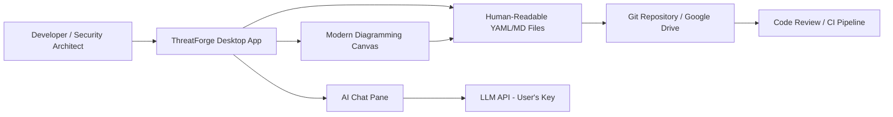
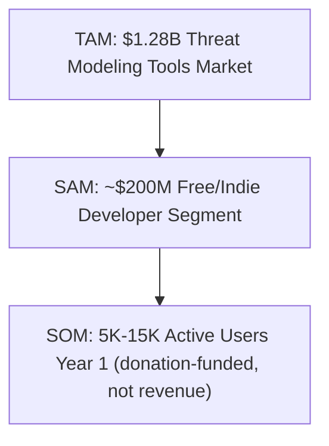
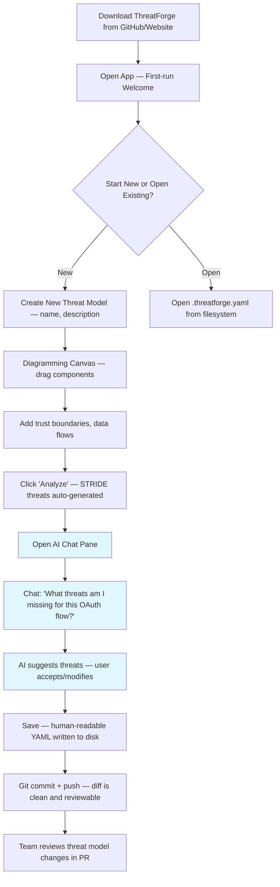
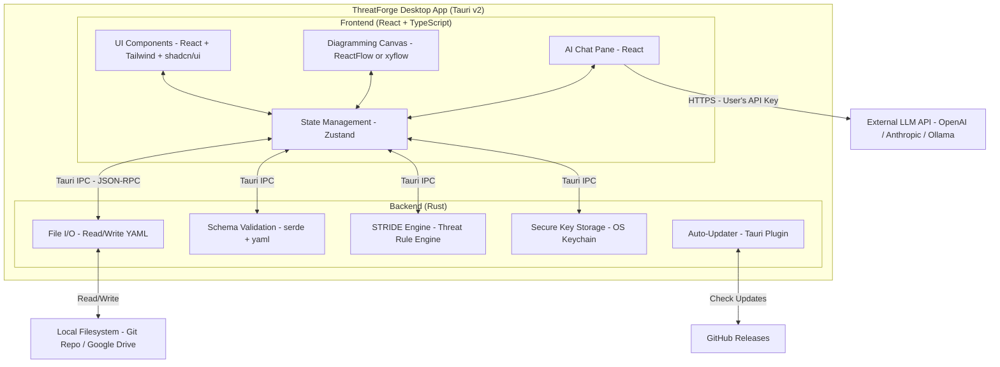
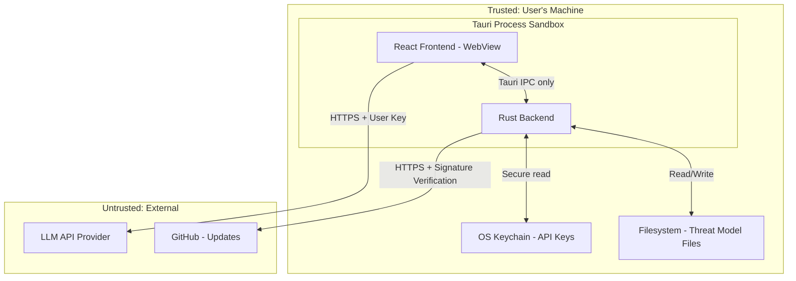
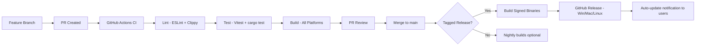
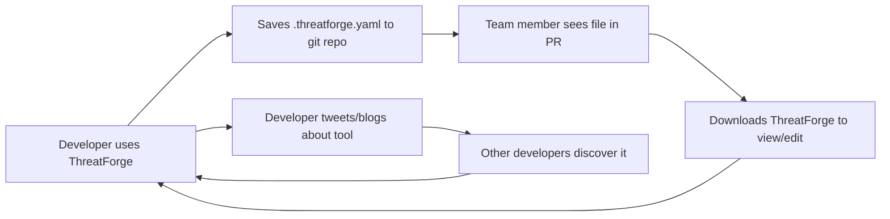
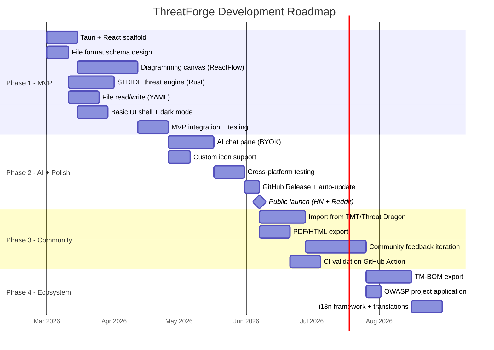

# ThreatForge — Project Document

## 1. Executive Brief

The threat modeling tooling space is stuck between two extremes: Microsoft's free but ancient, Windows-only Threat Modeling Tool (TMT) with its opaque `.tm7` binary files and clunky 2016-era UI, and enterprise platforms like ThreatModeler/IriusRisk (recently merged for $100M+) that cost thousands per year. Developers, security architects, and small-to-mid teams need a modern, open-source, cross-platform desktop tool that produces human-readable, git-friendly files — and that leverages AI to accelerate the most tedious parts of threat modeling.

**ThreatForge** is an open-source, AI-enhanced threat modeling desktop application built with Tauri v2 + React. It produces threat model files in a clean YAML/Markdown hybrid format that is human-readable, git-diffable, and version-controllable. An integrated AI chat pane helps users generate, modify, and analyze threat models conversationally, while a modern diagramming canvas with support for custom icons replaces the archaic drawing experience of existing tools.

**Why Now?** Three forces converge: (1) the OWASP TM-BOM standard is emerging as a file format standard for threat models, creating a window for a new tool to become the reference implementation, (2) AI coding is accelerating application creation, exponentially increasing the need for threat modeling (ThreatModeler's CEO: "The more code that gets cranked out, the more that needs to be evaluated"), and (3) regulatory mandates (PCI DSS 4.0, NIST SSDF, EU Cyber Resilience Act) are making threat modeling a compliance requirement, pushing adoption beyond security teams into mainstream development.

**Primary risk:** Open-source sustainability — maintaining momentum without revenue. Mitigated by targeting the developer tools community (high sponsorship appetite) and choosing a donation/sponsorship model that aligns with developer culture.

**Confidence: Medium** — Strong problem validation and timing, but open-source sustainability requires active community cultivation.



---

## 2. Market & Competitive Analysis

### 2.1 Market Sizing (TAM/SAM/SOM)

**Top-down:** The threat modeling tools market was valued at approximately USD $1.06–1.28 billion in 2024-2025, growing at a 14–15% CAGR, projected to reach $2.3–3.0 billion by 2030 (Mordor Intelligence, Research and Markets, GII Research). The broader application security market is projected at $21.9 billion by 2029 at a 21.8% CAGR (Technavio). [High confidence — multiple corroborating analyst sources]

**Bottom-up (for our open-source niche):**

- ~30 million professional developers worldwide (GitHub, Evans Data Corp)
- ~15% regularly engage with security tooling = 4.5M potential users
- ~5% of those would adopt a free, modern threat modeling tool = 225,000 users
- GitHub sponsorship conversion ~0.1-0.5% = 225-1,125 sponsors
- Average sponsorship ~$5-25/month = $13,500–$337,500/year potential sponsorship revenue

This is NOT a revenue play. As an open-source, donation-funded project, the relevant metric is adoption and community size, not market capture.

**SAM (directly addressable):** Individual developers and small/mid teams using free tools — estimated 2-5M globally who currently use Microsoft TMT, OWASP Threat Dragon, draw.io with security stencils, or no tool at all.

**SOM (realistic Year 1):** 5,000–15,000 active users, 2,000+ GitHub stars (based on Threat Dragon's trajectory of ~1,300 stars over ~9 years, with the advantage of modern UX and AI features).

[Medium confidence — bottom-up adoption estimates are analogical, based on comparable open-source security tools]



### 2.2 Market Dynamics & Trends

| Factor | Finding | Impact |
|--------|---------|--------|
| Regulatory mandates | PCI DSS 4.0, NIST SSDF, EU CRA all mandate threat modeling | **Strong tailwind** — forcing adoption beyond security teams |
| AI coding acceleration | AI-generated code increases volume needing security review | **Strong tailwind** — more code = more need for threat models |
| Enterprise consolidation | ThreatModeler acquired IriusRisk for $100M+ (Jan 2026) | **Tailwind** — creates a gap in the mid-market/indie space |
| OWASP TM-BOM standard | CycloneDX threat model bill of materials schema emerging | **Tailwind** — first-mover opportunity for file format adoption |
| 78% hiring gap | Organizations struggle to hire threat modeling staff | **Tailwind** — AI-assisted tools fill the expertise gap |
| Shift-left movement | Security moving earlier in SDLC, integrated with developer workflows | **Tailwind** — developers (not just security pros) need accessible tools |

[High confidence — sourced from Mordor Intelligence, Fortune (ThreatModeler acquisition), OWASP Foundation]

### 2.3 Competitive Landscape

| Dimension | ThreatForge (Proposed) | Microsoft TMT | OWASP Threat Dragon | ThreatModeler/IriusRisk | draw.io + Stencils | STRIDE-GPT |
|-----------|----------------------|---------------|--------------------|-----------------------|-------------------|------------|
| **Pricing** | Free (OSS) | Free | Free (OSS) | Enterprise ($$$) | Free | Free (OSS) |
| **Platform** | Win/Mac/Linux (Tauri) | Windows only | Web + Desktop (Electron) | SaaS | Web | Web (Streamlit) |
| **Modern UI** | ✅ React + Tailwind | ❌ 2016 WinForms | ⚠️ Functional, dated Vue UI | ✅ Modern SaaS | ⚠️ Generic | ⚠️ Basic |
| **AI Features** | ✅ Integrated chat pane | ❌ None | ❌ None | ✅ Jeff AI | ❌ None | ✅ Core feature |
| **Git-friendly files** | ✅ YAML/MD, human-readable | ❌ Binary .tm7 | ⚠️ JSON (verbose, hard to diff) | ❌ Proprietary SaaS | N/A | ⚠️ Markdown output only |
| **Custom icons** | ✅ | ❌ Fixed stencils | ❌ Fixed shapes | ✅ | ✅ Custom libs | N/A (no diagrams) |
| **STRIDE support** | ✅ | ✅ | ✅ | ✅ | ❌ Manual | ✅ |
| **GitHub Stars** | N/A (new) | N/A (closed) | ~1,300 | N/A (commercial) | N/A | ~600 |
| **Active Development** | New project | Minimal updates | Moderate (few releases/year) | Active (well-funded) | Active | Moderate |
| **Offline capable** | ✅ Full offline (AI optional) | ✅ | ⚠️ Web needs server | ❌ SaaS | ✅ Web but offline | ❌ Needs API |

### 2.4 White Space & Differentiation Thesis

The genuine unmet need sits at the intersection of three gaps no single tool fills:

1. **UX gap:** Microsoft TMT is the most widely used free tool but has a 2016-era Windows-only UI. Threat Dragon has improved but its interface is still functional-at-best, not delightful. No free tool offers the kind of polished, fast, keyboard-shortcut-driven experience that modern developers expect from tools like Linear, Figma, or VS Code.

2. **File format gap:** Microsoft's `.tm7` is a proprietary binary that cannot be meaningfully diffed in git. Threat Dragon uses JSON but it's verbose and tied to internal graph engine structures (AntV/X6 serialization), making diffs noisy. Neither produces files that a human can open in a text editor and understand. The OWASP TM-BOM initiative recognizes this gap but no tool has made it the centerpiece yet.

3. **AI integration gap:** STRIDE-GPT exists as a standalone Streamlit app, but it produces output, not an interactive model. No desktop threat modeling tool integrates conversational AI as a first-class feature for iteratively building and refining models.

**ThreatForge's differentiation is the combination:** a beautiful desktop app with a clean file format and native AI assistance. Each piece exists in isolation; no tool combines all three.

### 2.5 Defensibility Analysis

As an open-source, non-profit project, traditional moat analysis doesn't apply directly, but community defensibility matters:

- **Network Effects:** Limited — threat models are typically authored by small teams, not large networks. However, a shared file format standard creates lock-in-free adoption that benefits from ecosystem effects (CI integrations, converters, etc.).
- **Embedding:** High potential — if ThreatForge files become the de facto standard for git-tracked threat models, switching costs increase organically through CI pipeline integrations, code review workflows, and team familiarity.
- **Brand:** Achievable — OWASP Threat Dragon has brand recognition in the security community despite a dated UI. A tool that genuinely delights users in a space known for terrible UX can build strong word-of-mouth.
- **Scale:** N/A for open-source — no cost advantages from volume.

**Honest assessment:** Defensibility is weak in traditional terms. Anyone can fork or clone the project. The real defense is execution speed, community cultivation, and becoming the reference implementation for an emerging standard. This is consistent with successful open-source projects (VS Code, Grafana, etc.) where the brand and community become the moat.

**Confidence: Medium** — Competitive positioning is strong, but defensibility relies entirely on execution and community growth.

---

## 3. Product Vision & Design

### 3.1 Core Value Proposition

**"We help developers and security architects create and maintain threat models by providing a modern, AI-assisted desktop app with git-friendly file output, which is 10x faster and more pleasant to use compared to Microsoft Threat Modeling Tool."**

**JTBD Framework:**

- **Functional job:** Create, review, and maintain architectural threat models that identify security risks and their mitigations during the design phase of software development.
- **Emotional job:** Feel confident that security has been properly considered without being a security expert; feel that threat modeling is a productive use of time rather than a checkbox exercise.
- **Social job:** Demonstrate to the team, auditors, and stakeholders that a thorough security review was performed; appear professionally competent in security practices.

**10x test:** The combination of AI-assisted generation (reduce creation time from hours to minutes), human-readable files (eliminate the "what changed?" problem in code review), and a modern UI (reduce friction from clunky to pleasant) delivers a 10x improvement in the overall threat modeling experience. No single dimension is 10x, but the integrated experience is transformatively better.

### 3.2 User Personas

| Attribute | Alex — The Developer | Sam — The Security Architect | Jordan — The Team Lead |
|-----------|---------------------|-----------------------------|-----------------------|
| **Role** | Full-stack developer, startup or mid-size company | Application security engineer, enterprise | Engineering manager or tech lead |
| **Demographics** | 25-35, 3-8 years experience | 30-45, security-focused | 30-40, manages 5-15 engineers |
| **Pain Points** | Forced to use MS TMT for compliance but hates the UX; doesn't know STRIDE well; threat model files are opaque in PRs | Spends hours manually creating threat models; can't scale across 10+ teams; tools don't integrate with modern workflows | Can't review threat model changes in PRs; no way to enforce threat model updates as part of development process |
| **Current Alternative** | Microsoft TMT reluctantly, or skips it entirely | IriusRisk/ThreatModeler (if budget) or manual docs | Word docs or wiki pages with diagrams |
| **Willingness to Pay** | $0 (individual) but would sponsor $5-10/mo if tool saves time | Would advocate for team sponsorship $25-100/mo | Would sponsor at company level if tool proves value |
| **Acquisition Channel** | GitHub trending, Hacker News, dev Twitter/X, Reddit r/netsec | OWASP community, security conferences, LinkedIn | Team recommendation from Alex or Sam |

### 3.3 Feature Taxonomy (MoSCoW)

| Priority | Feature | User Value | Complexity |
|----------|---------|-----------|------------|
| **Must-have** | Modern diagramming canvas (DFD, trust boundaries, data flows) | Core workflow — draw the architecture | High |
| **Must-have** | YAML/Markdown human-readable file format | Git-diffable, human-readable threat models | Medium |
| **Must-have** | STRIDE threat enumeration (auto-suggest per element) | Core threat identification workflow | Medium |
| **Must-have** | AI chat side pane (BYOK — user brings own API key) | AI-assisted threat generation and refinement | High |
| **Must-have** | Cross-platform (Win/Mac/Linux via Tauri) | Developers aren't all on Windows | Medium |
| **Must-have** | Custom icon support (SVG import) | Teams can represent their specific tech stack | Low |
| **Should-have** | Import from Microsoft TMT (.tm7) and Threat Dragon (.json) | Migration path from existing tools | Medium |
| **Should-have** | Export to PDF/HTML report | Stakeholder communication and compliance | Medium |
| **Should-have** | LINDDUN privacy threat methodology support | Privacy-focused threat modeling | Low |
| **Should-have** | Dark mode and keyboard shortcuts | Developer experience expectations | Low |
| **Should-have** | Multiple diagram support per model | Complex systems need multiple views | Medium |
| **Could-have** | CI/CD integration (GitHub Action for validation) | Enforce threat model freshness in pipelines | Medium |
| **Could-have** | TM-BOM (CycloneDX) export | Standard interchange format | Medium |
| **Could-have** | Collaborative editing via git merge | Team workflows on shared models | High |
| **Won't-have (v1)** | Cloud/SaaS hosting | Scope creep; desktop-first, file-first | N/A |
| **Won't-have (v1)** | Real-time multi-user collaboration | Complex infrastructure for OSS project | N/A |
| **Won't-have (v1)** | Compliance framework mapping (PCI DSS, NIST) | Enterprise feature; focus on core first | N/A |

### 3.4 User Journey (Critical Path)



**Aha moment:** When the user saves for the first time, opens the `.threatforge.yaml` file in VS Code, and sees a clean, readable document instead of binary garbage. Second aha: when AI suggests a threat they hadn't considered.

**Time-to-value target:** < 10 minutes from download to first saved, human-readable threat model.

### 3.5 Key Screens & Interactions

1. **Main Canvas:** Split view with a diagramming surface (left/center) and a properties/threats panel (right). Component palette on the left edge with draggable elements (process, data store, external entity, data flow, trust boundary). Support for custom SVG icons on any element.

2. **AI Chat Pane:** Collapsible right-side panel that maintains conversation context about the current threat model. Can read the current model state and suggest modifications that the user can accept with one click. Uses BYOK (bring your own key) for OpenAI, Anthropic, or local models via Ollama.

3. **Threat Analysis View:** Table/list view of all identified threats, filterable by STRIDE category, severity, and mitigation status. Each threat linked to specific diagram elements.

4. **File Explorer:** Simple file browser that shows the working directory (designed to be a git repo) with `.threatforge.yaml` files. Shows git status indicators if in a git repo.

5. **Settings:** API key configuration, theme (light/dark), custom icon library management, export preferences.

### 3.6 Edge Cases & Error Handling

- **Offline operation:** Core diagramming and threat analysis work fully offline. AI features gracefully degrade with clear "No API key configured" or "Network unavailable" messaging.
- **File conflicts:** If the YAML file is modified externally (e.g., by a git merge), the app detects changes on focus and offers to reload. YAML format is designed to minimize merge conflicts by using sequential, atomic sections.
- **Large models:** For systems with 100+ elements, the canvas uses virtualized rendering. Threat lists paginate.
- **Invalid files:** Schema validation on file open with clear error messages pointing to the invalid section.
- **API key security:** Keys stored in OS keychain (macOS Keychain, Windows Credential Manager, Linux Secret Service) via Tauri's secure storage plugin. Never written to the threat model file.

### 3.7 Accessibility & Internationalization

- WCAG 2.1 AA compliance: Keyboard navigation for all canvas operations, screen reader labels for diagram elements, minimum 4.5:1 contrast ratios, focus management.
- Initially English-only with i18n architecture (string externalization) from day one for future community-driven translations.

### 3.8 Success Metrics (HEART Framework — adapted for open source)

| Metric | Definition | Target (6mo) | Target (12mo) |
|--------|-----------|-------------|--------------|
| **Happiness** | GitHub star growth rate; survey NPS | 2,000 stars | 5,000 stars; >50 NPS |
| **Engagement** | Monthly active users (opt-in telemetry) | 2,000 MAU | 8,000 MAU |
| **Adoption** | Downloads per month | 1,000/mo | 5,000/mo |
| **Retention** | % users active 30 days after first use | 25% | 35% |
| **Task Success** | % who save a complete threat model | >70% | >80% |

**Confidence: High** — Product design is well-grounded in validated user pain points and competitive gaps.

---

## 4. Technical Architecture & Implementation

### 4.1 System Architecture



### 4.2 Technology Stack Decisions

| Decision | Chosen | Alternatives Considered | Why Chosen | Key Tradeoff |
|----------|--------|----------------------|------------|-------------|
| **App Framework** | Tauri v2 | Electron, Flutter Desktop | ~10MB binary vs 100MB+ Electron; Rust backend for security and performance; native OS webview | Smaller ecosystem than Electron; Rust learning curve for contributors |
| **Frontend** | React 19 + TypeScript | Vue, Svelte, Solid | Largest contributor pool; your (Shreyas) existing expertise; most Tauri community examples | Heavier than Svelte/Solid; but the difference is negligible in a desktop app |
| **UI Library** | Tailwind CSS + shadcn/ui | MUI, Chakra, Ant Design | Lightweight, customizable, great dark mode support, growing desktop app adoption (Tauri-UI project) | More manual composition than MUI; but better control over UX |
| **Diagramming** | ReactFlow (xyflow) | mxGraph (draw.io), JointJS, AntV/X6 | MIT license; React-native; excellent performance; active development; built for node-based UIs | Less "traditional" DFD tooling than draw.io; but more customizable |
| **State Management** | Zustand | Redux, Jotai, React Context | Minimal boilerplate; great TypeScript support; performant; recommended for Tauri apps | Less middleware ecosystem than Redux; not needed at this scale |
| **File Format** | Custom YAML schema | JSON, TOML, XML, SQLite | Human-readable; git-diffable; YAML anchors for reuse; familiar to developers; easy to parse in any language | YAML has gotchas (indentation, type coercion); mitigated by strict schema validation |
| **Rust Serialization** | serde + serde_yaml | manual parsing | Industry standard; type-safe; automatic validation | Adds compile-time dependency; negligible concern |
| **AI Integration** | BYOK (user-provided API key) | Built-in API key, fine-tuned model | Zero cost to project; no rate limiting concerns; user controls their data; supports any provider | Requires user to have an API key; mitigated by making AI features optional |
| **Auto-Update** | Tauri updater plugin + GitHub Releases | Sparkle, custom server | Built into Tauri; free hosting via GitHub | Tied to GitHub; acceptable for an OSS project |

### 4.3 Data Architecture — File Format Design

This is the single most important technical decision for the project. The file format IS the product's moat.

**Design principles:**
1. Human-readable when opened in any text editor
2. Minimal, clean diffs when tracked in git
3. Schema-validated for tooling interoperability
4. Convertible to/from TM-BOM (CycloneDX) standard

**Example `.threatforge.yaml`:**

```yaml
# ThreatForge Threat Model
# Generated by ThreatForge v1.0.0
version: "1.0"
metadata:
  title: "Payment Processing Service"
  author: "Alex Chen"
  created: 2026-03-15
  modified: 2026-03-20
  description: |
    Threat model for the payment processing microservice
    that handles credit card transactions via Stripe API.

elements:
  - id: web-app
    type: process
    name: "Web Application"
    icon: custom/react-app.svg
    trust_zone: internal
    description: "React frontend served via CDN"

  - id: api-gateway
    type: process
    name: "API Gateway"
    trust_zone: dmz
    technologies: [nginx, rate-limiting]

  - id: payment-db
    type: data_store
    name: "Payment Database"
    trust_zone: internal
    stores: [transaction_records, tokenized_card_data]
    encryption: AES-256-at-rest

  - id: stripe-api
    type: external_entity
    name: "Stripe API"
    trust_zone: external

data_flows:
  - id: flow-1
    from: web-app
    to: api-gateway
    protocol: HTTPS/TLS-1.3
    data: [user_input, payment_request]
    authenticated: true

  - id: flow-2
    from: api-gateway
    to: payment-db
    protocol: PostgreSQL/TLS
    data: [transaction_records]

  - id: flow-3
    from: api-gateway
    to: stripe-api
    protocol: HTTPS/TLS-1.3
    data: [tokenized_card_data]

trust_boundaries:
  - id: boundary-1
    name: "Corporate Network"
    contains: [web-app, api-gateway, payment-db]

  - id: boundary-2
    name: "External Services"
    contains: [stripe-api]

threats:
  - id: threat-1
    title: "SQL Injection on payment queries"
    category: Tampering
    element: api-gateway
    flow: flow-2
    severity: High
    description: |
      Malicious SQL could be injected through payment
      parameters if input validation is insufficient.
    mitigation:
      status: mitigated
      description: "Parameterized queries via ORM; input validation layer"
    
  - id: threat-2
    title: "Man-in-the-middle on Stripe API calls"
    category: Information Disclosure
    element: api-gateway
    flow: flow-3
    severity: Medium
    description: "API calls to Stripe could be intercepted."
    mitigation:
      status: mitigated
      description: "TLS 1.3 enforced; certificate pinning"

diagrams:
  - id: main-dfd
    name: "Level 0 DFD"
    # Canvas layout data stored separately to keep diffs clean
    layout_file: ".threatforge/layouts/main-dfd.json"
```

**Key design choices:**
- Diagram layout coordinates stored in a separate `.threatforge/` directory so that repositioning elements doesn't create noise in the main threat model diff.
- Each threat is a discrete YAML block, so adding/removing threats creates clean, reviewable diffs.
- `icon` field supports relative paths to custom SVG files (stored in repo alongside the model).
- Schema versioned from v1.0 for future migration support.

### 4.4 Security Architecture

| Security Layer | Approach | Implementation |
|---------------|---------|----------------|
| **API Key Storage** | OS native keychain | Tauri keychain plugin (macOS Keychain, Windows Credential Manager, Linux Secret Service) |
| **AI API Calls** | Direct from user's machine, user's key | HTTPS only; keys never touch project files or telemetry |
| **File Integrity** | Schema validation on read | serde strict deserialization; reject unknown fields |
| **Auto-Update** | Signed releases | Tauri updater with signature verification via GitHub Releases |
| **Supply Chain** | Dependency auditing | Dependabot + cargo-audit in CI; minimal dependencies |
| **CSP** | Strict Content Security Policy | Tauri's default CSP; no remote code loading |
| **Input Sanitization** | All user input validated | Rust-side validation for file operations; React-side for UI |

**Trust boundary diagram:**



### 4.5 CI/CD & Development Workflow



- **Branch strategy:** Trunk-based development (main + feature branches)
- **Testing:** Vitest for frontend; cargo test for Rust; Playwright for E2E critical paths
- **Release:** Semantic versioning; GitHub Releases with signed binaries for all three platforms
- **Cross-platform builds:** GitHub Actions matrix (ubuntu, macos, windows)

### 4.6 Technical Debt & V1 Tradeoffs

| Shortcut | Justification | Debt Cost | When to Fix |
|----------|-------------|----------|------------|
| BYOK-only AI (no built-in inference) | Zero infrastructure cost; user data stays local | Users without API keys can't use AI features | When local model support (Ollama) is stable enough for good UX |
| ReactFlow instead of custom canvas | Faster development; proven library | Less control over DFD-specific interactions | When contribution volume justifies custom canvas engine |
| Layout data in separate JSON file | Keep YAML diffs clean | Two files per diagram instead of one | When a better approach emerges (e.g., stable layout algorithm) |
| English-only | Solo dev; limited time | Excludes non-English users | When community volunteers offer translations |

### 4.7 Critical Technical Risks

1. **ReactFlow DFD fit:** ReactFlow is designed for node-based editors, not traditional DFDs. Trust boundaries (drawn as rectangles around groups of elements) may require significant custom work. **Fallback:** Use a simpler approach where trust boundaries are defined in YAML and rendered as colored backgrounds, not interactive shapes.

2. **YAML file format adoption:** If the community doesn't adopt the format, the tool becomes just another drawing tool. **Mitigation:** Support import/export from existing formats (.tm7, Threat Dragon JSON, TM-BOM) from day one. Make the format compelling enough that people choose it.

3. **Cross-platform Tauri quirks:** WebView rendering differences across Windows (Edge WebView2), macOS (WebKit), and Linux (WebKitGTK) can cause subtle UI bugs. **Mitigation:** Test on all platforms in CI; use Tailwind (which abstracts most rendering differences); avoid platform-specific CSS features.

**Confidence: High** — The technology stack is proven and well-documented. Risks are manageable.

---

## 5. Business Model & Economics

### 5.1 Revenue Model

**This is an open-source, not-for-profit project. Revenue is not the goal; sustainability is.**

Funding model: Donations and sponsorships only.

| Source | Mechanism | Estimated Annual | Probability |
|--------|----------|-----------------|------------|
| **GitHub Sponsors** | Individual developer sponsorships ($5-25/mo) | $5,000-$30,000 | Medium |
| **Corporate sponsorships** | Companies whose teams use ThreatForge | $10,000-$50,000 | Medium (requires 10K+ users) |
| **Open Collective** | One-time and recurring donations | $2,000-$10,000 | Medium |
| **GitHub Sponsors for Organizations** | Companies sponsoring for logo placement | $5,000-$20,000 | Low-Medium |

**Total estimated Year 2 funding: $20,000–$100,000** — wide range reflecting the uncertainty of open-source funding. This is sufficient for infrastructure costs and modest contributor bounties, not full-time salary.

**Comparable open-source projects and their funding:**
- OWASP Threat Dragon: Volunteer-driven, no dedicated funding
- Excalidraw: ~$180K/year via Excalidraw+ (freemium web service)
- Insomnia (pre-acquisition): ~$1M/year via paid plans before Kong acquired it

### 5.2 Cost Structure

| Category | Year 1 | Year 2 | Notes |
|----------|--------|--------|-------|
| **Domain + hosting** | $200 | $200 | GitHub Pages for docs, custom domain |
| **Code signing certificates** | $400 | $400 | Apple Developer ($99) + Windows Authenticode (~$300) |
| **CI/CD compute** | $0 | $0 | GitHub Actions free for public repos |
| **Design tools** | $150 | $150 | Figma free tier + icon resources |
| **Developer time** | $0 (founder time) | $0 (founder time) | Open source, evening/weekend project |
| **Total** | ~$750 | ~$750 | Extremely lean |

### 5.3 Path to Sustainability

This project follows the **"cathedral and bazaar" model** — Shreyas builds the core as a solo developer, then the community contributes. Sustainability milestones:

1. **Phase 1 (0-6 months):** Solo development. Zero external funding needed. Ship MVP.
2. **Phase 2 (6-12 months):** Community forms. Open GitHub Sponsors. First corporate users.
3. **Phase 3 (12-24 months):** If adoption exceeds 10K users, apply for OWASP project status (like Threat Dragon). Seek corporate sponsorships from security tool companies or cloud providers.
4. **Long-term:** If the project reaches critical mass (50K+ users), explore a managed cloud service (like Excalidraw+) as an optional paid offering, while keeping the desktop app fully free and open source.

**Confidence: Low-Medium** — Open-source funding is inherently unpredictable. The project must be viable as a passion project first.

---

## 6. Go-to-Market Strategy

### 6.1 Beachhead Market

**Primary segment:** Individual developers and small security teams (2-10 people) at companies with 50-500 employees who currently use Microsoft TMT reluctantly or don't threat model at all because existing tools are too painful.

**Why this segment first?** They have the pain (compliance requirements pushing them to threat model) but not the budget for enterprise tools (ThreatModeler/IriusRisk at $20K+/year). They are also the most likely to discover and adopt open-source tools via GitHub and Hacker News.

**Expansion path:** Small teams → mid-market companies → OWASP community adoption → de facto standard for individual/team threat modeling (while enterprise tools serve the high end).

### 6.2 Positioning & Messaging

**"For developers and security engineers who need to create threat models, ThreatForge is a free, open-source desktop app that makes threat modeling fast, AI-assisted, and git-native. Unlike Microsoft Threat Modeling Tool, ThreatForge runs on all platforms, produces human-readable files, and integrates AI to help you identify threats you'd otherwise miss."**

### 6.3 Acquisition Channels

| Channel | Strategy | Cost | Volume | Timeline | Priority |
|---------|----------|------|--------|----------|----------|
| **GitHub / README** | Excellent README with demo GIFs, clear install instructions | $0 | High (long-term) | Day 1 | 1 |
| **Hacker News launch** | Show HN post with compelling demo | $0 | Spike (1 day) | At MVP launch | 1 |
| **Reddit (r/netsec, r/cybersecurity, r/programming)** | Post with genuine value, not self-promotion | $0 | Medium | At launch | 2 |
| **Dev Twitter/X + Bluesky** | Build in public; share progress, design decisions | $0 | Slow build | Ongoing | 2 |
| **OWASP Community** | Contribute to OWASP discussions on TM-BOM; position as complementary to Threat Dragon | $0 | Medium (targeted) | Month 2+ | 3 |
| **Security conference lightning talks** | BSides, local OWASP chapters, DevSecOps meetups | $0-500 (travel) | Low but high-quality | Month 6+ | 4 |
| **YouTube / blog content** | Tutorials on threat modeling with ThreatForge; comparison videos | $0 | Medium (SEO) | Month 3+ | 3 |

### 6.4 Growth Loop



**Primary growth loop:** File-format virality. When one team member commits a `.threatforge.yaml` file, others on the team need ThreatForge to view/edit it. This is the same loop that made VS Code's settings.json, Prettier's config files, and Terraform's .tf files spread through teams.

**Secondary loop:** Build-in-public content → developer community awareness → adoption.

**Confidence: Medium** — The file-format virality loop is proven in developer tools but requires critical mass.

---

## 7. Implementation Roadmap



### 7.1 Phase 1: MVP (Weeks 1-8)

**Scope:** Core diagramming canvas + YAML file format + STRIDE engine. No AI yet.
**Success criteria:** A user can draw a DFD, auto-generate STRIDE threats, save to a human-readable YAML file, and reopen it.
**Kill gate:** If the diagramming canvas doesn't feel fast and responsive by week 6, pivot to a simpler approach (e.g., form-based element entry with auto-generated diagrams).

### 7.2 Phase 2: AI + Polish (Weeks 9-14)

**Scope:** AI chat pane, custom icons, cross-platform builds, auto-update.
**Success criteria:** Public launch on GitHub. First 100 stars.
**Key dependency:** ReactFlow canvas must be solid from Phase 1.

### 7.3 Phase 3: Community (Weeks 15-22)

**Scope:** Import/export, PDF reports, community feedback.
**Success criteria:** 1,000+ stars, 500+ downloads, first external contributor.

### 7.4 Phase 4: Ecosystem (Months 6-12)

**Scope:** TM-BOM standard, OWASP project status, internationalization.
**Success criteria:** 3,000+ stars, recognized in OWASP community, first corporate sponsor.

**Confidence: Medium** — Timeline is aggressive for a solo dev side project. Phase 1 is the most critical; if the canvas UX is right, the rest follows.

---

## 8. Risk Assessment

### 8.1 Risk Matrix

| Risk | Category | Likelihood | Impact | Mitigation |
|------|----------|-----------|--------|-----------|
| ReactFlow insufficient for DFDs | Technical | Medium | High | Prototype canvas first; fallback to simpler form-based entry |
| Low adoption / no community forms | Market | Medium | High | Launch on multiple channels; build in public to attract early users |
| Solo dev burnout | Execution | Medium | High | Scope ruthlessly; accept contributions early; don't over-promise |
| File format doesn't gain traction | Market | Medium | Medium | Support import/export from existing formats; propose to OWASP TM-BOM |
| Tauri cross-platform bugs | Technical | Low | Medium | Test in CI on all platforms; use Tailwind for CSS consistency |
| AI features perceived as gimmicky | Product | Low | Low | Make AI genuinely useful for threat suggestion; it's optional, not core |
| Existing tool (Threat Dragon) leapfrogs | Competition | Low | Medium | Move faster; modern UX is hard to retrofit onto a Vue/AntV codebase |

### 8.2 Pre-Mortem: How This Fails

1. **"Built it but nobody came" (Demand failure, Likelihood: Medium):** Shreyas spends 6 months building a polished tool, launches on Hacker News, gets 200 upvotes and 50 stars... then crickets. The problem is real but the market is too niche — most developers avoid threat modeling regardless of how good the tool is. Six months later the repo is stale with 0 contributors. **Mitigation:** Validate demand before Phase 2 by shipping a minimal MVP (even just the file format + a simple editor) and gauging reaction. If the first launch gets < 100 stars in a week, reconsider scope.

2. **"Canvas became a monster" (Execution failure, Likelihood: Medium):** Building a good diagramming experience turns out to be 5x harder than expected. ReactFlow needs extensive customization for DFD conventions. Trust boundaries, data flow labels, and element grouping each add weeks of work. The project gets stuck in Phase 1 for 4+ months and loses momentum. **Mitigation:** Time-box canvas development to 6 weeks. If it's not good enough, ship with a simpler representation and iterate based on user feedback.

3. **"The file format was a mistake" (Technical failure, Likelihood: Low):** The YAML format has edge cases that make git diffs messy in practice (YAML anchors, multi-line strings, indentation shifts). Users report that the file is "human-readable but not human-diffable." The core differentiator fails. **Mitigation:** Prototype the file format extensively before building the app. Create 10 sample threat models, commit them to a test repo, make typical edits, and verify that diffs are clean. This can be validated in week 1.

### 8.3 Kill Criteria

| Kill Trigger | Metric | Threshold | Timeframe |
|-------------|--------|----------|-----------|
| No demand signal | GitHub stars after HN launch | < 100 stars in first 2 weeks | Month 4 (at launch) |
| Can't build usable canvas | DFD drawing experience quality | Self-assessment: "Would I use this?" = No | Week 8 |
| No community formation | External contributors / issues | 0 external contributors after 6 months | Month 9 |
| Burnout | Personal motivation | Dreading working on it for 3+ consecutive weeks | Ongoing |

**Confidence: Medium** — Risks are well-understood. The biggest risk is execution capacity as a side project.

---

## 9. Reasons to Believe & Reasons to Doubt

### 9.1 Reasons to Believe

- **Validated pain:** Microsoft TMT's UX problems and file format opacity are widely documented. This isn't a hypothetical pain point.
- **Timing:** Regulatory mandates (PCI DSS 4.0, NIST SSDF) are forcing more teams to threat model. The enterprise space just consolidated ($100M merger). The middle market is wide open.
- **Builder-market fit:** Shreyas works at Microsoft on Teams and understands the security engineering culture, STRIDE methodology, and developer tooling expectations firsthand. He has the technical skills (React, TypeScript) and the domain knowledge.
- **Tauri is ready:** Tauri v2 is mature enough for production desktop apps with strong community and documentation.
- **Open-source advantages:** No hosting costs, free CI, community contributions, and organic distribution through GitHub.
- **File-format virality:** Developer tools that introduce good file formats (Terraform .tf, Prettier .prettierrc, ESLint .eslintrc) spread through teams organically.

### 9.2 Reasons to Doubt

- **Side project risk:** Building a polished desktop app with a custom diagramming canvas, AI integration, and cross-platform support is a substantial undertaking for evenings and weekends. Historically, ambitious side projects have a high abandonment rate.
- **Niche market:** Threat modeling is a niche within a niche (security within development). The addressable audience who would actually use a dedicated tool (vs. a Confluence page or a whiteboard) may be smaller than estimated.
- **No revenue = fragile sustainability:** Without revenue, the project depends entirely on Shreyas's motivation and time. If life circumstances change (wedding planning, job demands), the project could stall.
- **Competition from AI:** ChatGPT/Claude can already generate reasonable threat models from architecture descriptions. A standalone tool needs to offer significantly more than "paste your architecture into an LLM."
- **Threat Dragon could improve:** OWASP Threat Dragon is actively developed and planning a v3 with a new file format (TM-BOM). If they execute well, ThreatForge's differentiators narrow.

---

## 10. Open Questions & Validation Plan

| Question | Impact | Uncertainty | Validation Method | Timeline |
|----------|--------|------------|------------------|----------|
| Is the YAML file format actually git-diffable in practice? | High | Medium | Create 10 sample models, make typical edits, verify diffs | Week 1 |
| Can ReactFlow be customized for DFD conventions? | High | Medium | 2-day prototype spike: trust boundaries, data flow labels | Week 2 |
| Will developers adopt a new file format? | High | High | Launch file format spec as a standalone RFC before building the app | Month 1 |
| Is BYOK AI useful enough without fine-tuning? | Medium | Medium | Test with Claude/GPT on 5 real threat models; measure suggestion quality | Month 2 |
| Can one person maintain cross-platform Tauri builds? | Medium | Low | Set up CI matrix early; test on all platforms by Week 4 | Week 4 |

---

## 11. Investment & Resource Requirements

### 11.1 Team Plan

| Role | Who | When | Cost |
|------|-----|------|------|
| Founder / Solo Developer | Shreyas | Day 1 | $0 (side project) |
| Community Contributors | Open source community | Month 4+ | $0 (bounties possible later) |
| Design feedback | Security engineer friends / Reddit | Month 2+ | $0 |

### 11.2 Budget Summary

| Category | Year 1 | Year 2 |
|----------|--------|--------|
| Infrastructure | $200 | $200 |
| Code signing | $400 | $400 |
| Design assets | $150 | $150 |
| Marketing | $0 | $0-500 (conference travel) |
| **Total** | **$750** | **$750-$1,250** |

This is fundable entirely from personal budget with zero external capital required.

---

## 12. Conclusion & Recommendation

### 12.1 Go / No-Go Recommendation

**Conditional GO.** The project is viable and well-timed, but should proceed with strict scope discipline and clear kill criteria.

The condition: **Validate the two highest-risk assumptions before investing more than 2 weeks of development time:**
1. Build a prototype of the YAML file format and verify git-diffability (1 day)
2. Build a ReactFlow prototype with DFD elements and trust boundaries (2-3 days)

If both pass, proceed to full MVP development. If either fails, either pivot the approach or shelve the project.

### 12.2 Critical Success Factors

1. **The file format must be genuinely pleasant to read and diff.** This is the core differentiator. If the YAML is messy, the project loses its reason to exist.
2. **The diagramming experience must be fast and fluid.** If drawing a DFD is painful, users won't come back.
3. **Launch must reach the right audience.** A Hacker News front page or popular security newsletter feature is needed for initial traction.
4. **Scope discipline.** Ship the MVP in 8 weeks, not 16. Perfect is the enemy of shipped.
5. **Shreyas must enjoy building it.** This is a side project. If it becomes a chore, it will die.

### 12.3 Confidence Level

**Overall: Medium.** The problem is real, the timing is right, and the technical approach is sound. The primary uncertainty is execution capacity as a solo side project and whether the niche is large enough to sustain community growth. The extremely low capital requirement ($750/year) means the downside is limited to time invested.

### 12.4 Immediate Next Steps

| Timeframe | Action | Owner | Success Metric |
|-----------|--------|-------|---------------|
| Day 1-2 | Design YAML schema, create 10 sample files, test git diffs | Shreyas | Clean, reviewable diffs on all 10 samples |
| Day 3-5 | ReactFlow DFD prototype (elements, flows, trust boundaries) | Shreyas | Can draw a basic DFD that "feels right" |
| Week 2 | Tauri v2 scaffold with React + TypeScript + Tailwind | Shreyas | App launches on Mac and Windows |
| Week 3-4 | Core canvas integration + file read/write | Shreyas | Can save and reopen a threat model |
| Week 5-8 | STRIDE engine + basic UI polish | Shreyas | Usable MVP without AI features |

---

## 13. Appendices & References

### 13.1 Research Sources

- Mordor Intelligence, "Threat Modeling Tools Market Size, Share, 2025-2030 Outlook" (2025)
- Research and Markets, "Threat Modeling Tools Market Size, Share & Forecast to 2032" (2025)
- Fortune, "ThreatModeler acquires IriusRisk for over $100 million" (January 2026)
- OWASP Foundation, "OWASP Threat Dragon" — github.com/OWASP/threat-dragon (1,300 stars)
- GitHub Topics, "threat-modeling" — topic page with 1,700+ star curated list
- ThreatModeler, "ThreatModeler vs. Microsoft Threat Modeling Tool" (December 2025)
- Tauri documentation — tauri.app (v2 stable release 2024)
- OWASP, "Threat Modeling Methodology v2.0" (May 2025)
- SiliconANGLE, "ThreatModeler acquires IriusRisk" (January 2026)
- Various user complaints: Microsoft Q&A forums, LinkedIn articles on TMT scalability issues

### 13.2 Glossary

| Term | Definition |
|------|-----------|
| **STRIDE** | Spoofing, Tampering, Repudiation, Information Disclosure, Denial of Service, Elevation of Privilege — Microsoft's threat classification framework |
| **DFD** | Data Flow Diagram — visual representation of system components and data movement |
| **TM-BOM** | Threat Model Bill of Materials — CycloneDX standard for threat model interchange |
| **BYOK** | Bring Your Own Key — user provides their own LLM API key |
| **TMT** | Microsoft Threat Modeling Tool |
| **Tauri** | Lightweight, Rust-based framework for cross-platform desktop apps using web frontends |
| **LINDDUN** | Linkability, Identifiability, Non-repudiation, Detectability, Disclosure of Information, Unawareness, Non-compliance — privacy threat modeling framework |

### 13.3 Comparable Open-Source Projects

| Project | Relevance | Outcome |
|---------|-----------|---------|
| **Excalidraw** | Open-source diagramming tool with a delightful UX that exploded in popularity | 90K+ GitHub stars; proves modern UX in a traditionally boring space wins |
| **OWASP Threat Dragon** | Direct competitor; open-source threat modeling tool | 1,300 stars over 9 years; functional but not beloved; validates the space exists |
| **STRIDE-GPT** | AI-powered threat model generator | 600 stars; proves AI + STRIDE has demand; but it's output-only, no interactive modeling |
| **Insomnia** | Open-source API client that disrupted Postman before going commercial | Proved that developer tools with great UX can build large communities via GitHub; later acquired by Kong |
| **Linear** | Project management tool known for exceptional UX | Proves that in a space full of clunky tools, a fast + beautiful experience wins even against entrenched players |
